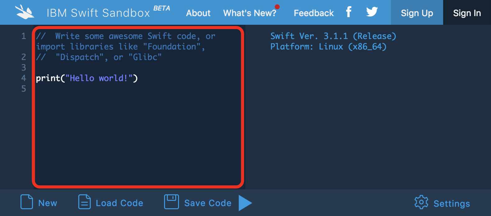

# はじめの一歩

どんなにおもしろいゲームでも、画面に表示してくれないと遊ぶことはできません。はじめに、画面に文字を表示する方法を学びましょう。

まずはどんなものか体験することが大事です。詳しい話は後にして、次の Web サイトを開いて下さい。

[IBM Swift Sandbox](https://swift.sandbox.bluemix.net/)

ページの左側（スマートフォンの場合は上部）に次のような英語の文章が表示されているはずです。

```swift
//  Write some awesome Swift code, or import libraries like "Foundation",
//  "Dispatch", or "Glibc"

print("Hello world!")
```

この部分（下図の赤枠の中）をクリック（タップ）して文章を全部消して下さい。



それではプログラムを書いてみましょう。

今、 HP が 153 とします。これを表示する方法を説明します。

画面に文字を表示するには `print` という命令を使います。 print は英語で「印刷する」という意味です。日本語でも印刷することをプリントする、印刷機をプリンターと言いますね。

`print` は紙ではなく画面に「印刷する」、つまり表示するための命令です。

では、先程の赤枠のエリアに `print` と書いてみて下さい。

```swift
print
```

これだけでは何を `print` したいのかわかりません。今、表示したいのは HP である 153 でした。

`print` したいものは、 `print` の後に `()` を付けて書きます。

```swift
print(153)
```

これで初めてのプログラムは完成です。これを実行してみましょう。画面下部の▶ボタンを押すとプログラムが実行されます。

```
153
```

画面右側の結果を表示するエリアに <code class="sq-output">153</code> と表示されましたね。数字を表示するだけの単純なプログラムですが、これでもれっきとしたプログラムです。

`print` の `()` の中を変更すると表示される文字も変わります。たとえば、敵の攻撃で 5 のダメージを受けて HP が 148 になったとします。 `()` の中を `148` に変えて実行してみましょう。

```swift
print(148)
```

```
148
```

今度は <code class="sq-output">148</code> と表示されましたね。あなたが書いた命令通りにコンピューターが動作しました。

さて、今は 153 - 5 = 148 という計算を自分で計算しました。しかし、計算はコンピューターの得意技です。せっかくコンピューターを使っているのだから、計算はコンピューターにやってもらいましょう。

`print` の `()` の中を `148` から `153 - 5` に書きかえて実行してみて下さい。

```swift
print(153 - 5)
```

```
148
```

なんと、 `()` の中を `148` ではなく `153 - 5` と書いても <code class="sq-output">148</code> と表示されました。このように、 `print` の `()` の中には数字だけじゃなくて計算式も書けるのです。

ひき算と同じように、たし算やかけ算、わり算をすることもできます。

`-` でひき算ができたように、 `+` でたし算ができます。

```swift
print(6 + 3)
```

```
9
```

かけ算には、 × の代わりに `*` を使います。

```swift
print(6 * 3)
```

```
18
```

わり算には、 ÷ の代わりに `/` を使います。

```swift
print(6 / 3)
```

```
2
```

コンピューターは計算が得意なので、難しいかけ算でも一瞬で計算することができます。

```swift
print()
```

```swift
print(12345 * 9876)
```

```
121919220
```

すごいですね！

他にも、色々な計算をさせて遊んでみて下さい。 **プログラミングを学ぶときは書いてあることをそのままやってみるだけでなく、「ここの変えたらどうなるんだろう？」と考えて色々試してみることが大切です。** 自分で考えて試してみることで理解が深まり、それを使いこなすことができるようになるからです。

さて、「はじめの一歩」はこれで終わりです。プログラミングが魔法だとすると、あなたはもう Lv 1 の魔法使いです。数字を表示するだけでなく、難しい計算も一瞬で解いてしまう「魔法」が使えるようになりました。おめでとうございます！

## 練習問題

### 問 1

魔法使いの HP は 77 です。画面に 77 と表示するプログラムを作って下さい。

### 問 2

魔法使いの HP は 77 でしたが、敵の攻撃で 48 のダメージを受けました。残りの HP を表示して下さい。ただし、計算はコンピュータにさせて下さい。

### 問 3

勇者の攻撃力は 162 ですが、 _ストライキング_ の魔法で攻撃力が 2 倍になりました。 2 倍になった後の勇者の攻撃力を表示して下さい。ただし、計算はコンピューターにさせて下さい。

## 答え

### 問 1

```swift
print(77)
```

### 問 2

```swift
print(77 - 48)
```

### 問 3

```swift
print(162 * 2)
```
